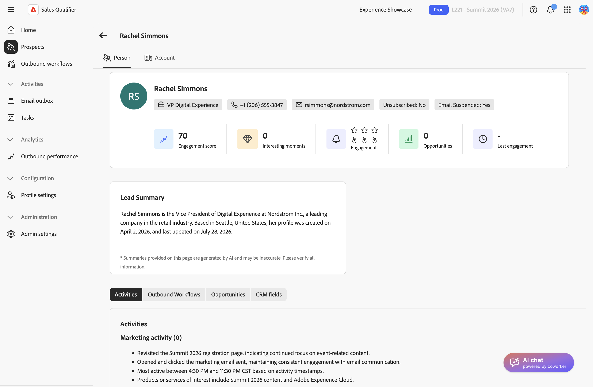
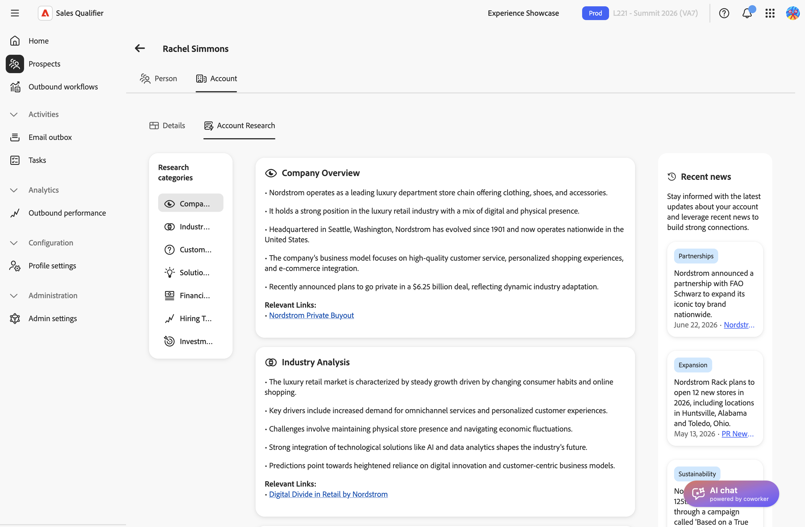

# Cuentas

La vista de cuentas combina investigación generada por IA, noticias recientes, oportunidades abiertas, valor de la canalización y contactos comprometidos. Utilice esta información para comprender y priorizar una cuenta antes de establecer contacto.

## Abrir una cuenta

Abra una cuenta desde el perfil de un cliente potencial asociado a ella.

1. Seleccione **[!UICONTROL Clientes potenciales]** en el panel de navegación izquierdo y abra un cliente potencial. Ver [clientes potenciales](prospects.md).
1. En la página de detalles del posible cliente, seleccione la ficha **[!UICONTROL Cuenta]**.

{width="800" zoomable="yes"}

Sales Qualifier identifica la cuenta del registro de CRM del cliente potencial. La misma vista de cuenta está disponible en todos los clientes potenciales asociados a esa cuenta. Si Sales Qualifier no puede coincidir con una cuenta, la pestaña muestra _No se encontró ninguna cuenta_.

>[!NOTE]
>
>Las secciones y métricas disponibles dependen de su CRM, de la configuración de su organización y de los datos de la cuenta. Si no aparece una sección descrita aquí, no se configuran los datos o la función necesarios.

La vista de cuenta tiene dos fichas: **[!UICONTROL Detalles]** y **[!UICONTROL Investigación de la cuenta]**.

## Revise los detalles de la cuenta

La ficha **[!UICONTROL Detalles]** le proporciona una instantánea de la cuenta y su canalización.

### Resumen de cuenta

La tarjeta Información general de la parte superior de la pestaña identifica la cuenta y resume su valor:

* Nombre y región de la cuenta
* **Ingresos recurrentes anuales (ARR)**: los ingresos recurrentes anuales en todas las suscripciones activas. Seleccione **[!UICONTROL Ver todo]** para revisar ARR por producto en el diálogo **[!UICONTROL Ingresos anuales recurrentes]**.
* Estadísticas de cuenta, incluidos los recuentos de oportunidades abiertas y contactos y el valor de la canalización

### Resumen de descripción general de cuenta

El panel **[!UICONTROL Descripción general de la cuenta]** resume la cuenta en función de los datos de CRM y la investigación de Account Qualification Agent. Si la investigación está en curso, el panel muestra un estado de carga. Si la búsqueda no está disponible, el panel muestra un mensaje.

### Perspectivas de cuenta

Utilice los botones que aparecen debajo de la descripción general para cambiar entre las vistas de cuenta. Las vistas disponibles dependen de su CRM y de la configuración:

| Ver | Lo que muestra |
| --- | --- |
| **[!UICONTROL Oportunidades]** | Abra las oportunidades vinculadas a la cuenta, con campos clave para cada una. Seleccione **[!UICONTROL Ver todo]** para ver la lista completa en una tabla. Los detalles de oportunidad, como la fase, el tipo y la fecha de cierre, también se pueden usar para filtrar los contactos de la cuenta en **[!UICONTROL Mis contactos de oportunidad]** cuando un administrador hace que esos campos sean filtrables. |
| **[!UICONTROL Miembros principales]** | Los contactos más comprometidos de la cuenta, clasificados por participación. Cada contacto muestra su cargo, dirección de correo electrónico, puntuación de participación e indicador de urgencia. |
| **[!UICONTROL Datos de intención]** | Las señales de intención de compra para la cuenta, como los productos y temas que está investigando la cuenta. |
| **[!UICONTROL Miembros del equipo de cuenta]** | Personas asignadas a la cuenta, con su correo electrónico, cargo, territorio y grupo de productos. |
| **[!UICONTROL Campos CRM]** | Campos de cuenta importados desde CRM, según la configuración de asignación de entrada. Consulte [Integraciones](integrations.md#map-crm-fields-inbound-mapping). |

Desde la vista **[!UICONTROL Miembros principales]**, realice cualquiera de estas acciones para un contacto:

* **[!UICONTROL Agregar a flujo de trabajo saliente]**: inscriba al contacto en un [flujo de trabajo saliente](outbound-workflows.md).
* **[!UICONTROL Agregar a la campaña de Marketo]**—Déclencheur una campaña [!DNL Marketo] para el contacto.

## Investigue la cuenta

La ficha **[!UICONTROL Investigación de la cuenta]** contiene tres áreas:

* **[!UICONTROL Categorías de investigación]**: temas de investigación. Seleccione una categoría para ver su búsqueda en el panel central.
* **Contenido de investigación**: tarjetas de investigación generadas por IA agrupadas por categoría. Una tarjeta puede incluir el dominio de origen y las fechas en las que se detectó la señal por primera vez y por última vez.
* **[!UICONTROL Noticias recientes]**: noticias actuales sobre la cuenta, incluidas fechas, etiquetas y vínculos de origen.

{width="800" zoomable="yes"}

Si las investigaciones o las noticias no se pueden cargar, cada área ofrece una acción **[!UICONTROL Recargar]** para intentarlo de nuevo.

## Uso de la inteligencia de cuentas en alcance

La inteligencia de cuentas es muy valiosa cuando da forma a lo que envía:

* Haga referencia a una noticia reciente o a una señal de investigación para que su apertura sea relevante en lugar de utilizar un tono genérico.
* Compruebe las oportunidades abiertas y el valor de la canalización para decidir si prioriza la cuenta.
* Use **[!UICONTROL Miembros principales]** para identificar con quién comunicarse y luego inscribirlos en un flujo de trabajo de salida.
* Pida a [AI Chat](ai-assistant.md) que desarrolle el posicionamiento de la cuenta antes de una llamada.

>[!MORELIKETHIS]
>
>* [Clientes potenciales](prospects.md)
>* [Flujos de trabajo salientes](outbound-workflows.md)
>* [Chat de IA](ai-assistant.md)
